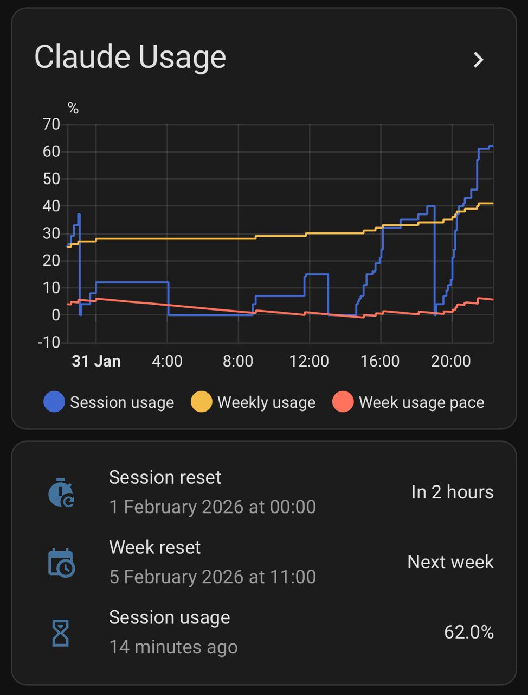

# Codex Usage - Home Assistant Integration

A custom Home Assistant integration that monitors your OpenAI Codex subscription usage.



## Sensors

- **Session Usage** - Current primary Codex usage window utilization (%)
- **Session Reset Time** - When the primary usage window resets
- **Weekly Usage** - Current secondary Codex usage window utilization (%)
- **Weekly Usage Pace** - How far weekly usage is ahead of or behind the reset window
- **Weekly Reset Time** - When the weekly usage window resets
- **Credits Balance** - Remaining Codex credits when reported by the API
- **Credits Enabled** - Whether credits are available for the account
- **Rate Limit Reached** - Current backend-reported limit state

## Installation

### HACS (recommended)

1. Add this repository as a custom repository in HACS
2. Restart Home Assistant
3. Install "Codex Usage"
4. Go to Settings -> Devices & Services -> Add Integration -> "Codex Usage"
5. Follow the instructions

### Manual

1. Copy `custom_components/hass_codex_usage/` to your HA `custom_components/` directory
2. Restart Home Assistant
3. Add the integration via the UI

## Setup

The integration uses Codex OAuth credentials created by the Codex CLI:

1. On the Home Assistant host, install Codex and run `codex login`
2. Confirm the host has a Codex auth file, normally `~/.codex/auth.json`
3. Add the integration in Home Assistant
4. Enter the auth file path from the Home Assistant host

The integration reads the Codex auth file at each poll. It does not store your Codex access token in the Home Assistant config entry.

## Options

- **Update interval** - How often to poll the usage API (default: 300 seconds, min: 60, max: 3600).

## Dashboard

A pre-built dashboard is included in the `dashboards/` directory. To use it:

1. Go to Settings -> Dashboards -> Add Dashboard
2. Click the three-dot menu -> "Edit Dashboard"
3. Click the three-dot menu again -> "Raw configuration editor"
4. Copy the contents of `dashboards/codex_usage.yaml` and paste it
5. Click "Save"

Alternatively, you can manually add the cards to any existing dashboard by referencing the YAML file.

## Rate Limit

Codex usage APIs are not documented as a public Home Assistant integration surface. Keep the default 300 second polling interval unless you have a specific reason to change it.

## Development

### Pre-commit Hook

Install the pre-commit hook to automatically format code before committing:

```bash
pip install pre-commit
pre-commit install
```

This will run black, isort, ruff, and other checks before committing.

### Manual Formatting

```bash
pip install black isort ruff
black custom_components/hass_codex_usage/
isort custom_components/hass_codex_usage/
ruff check --fix custom_components/hass_codex_usage/
```

## Credits

This integration is a modified version of [hass-claude-usage](https://github.com/trickv/hass-claude-usage) by [Patrick van Staveren](https://github.com/trickv). It has been adapted to work with the OpenAI Codex backend usage API.

## License

MIT License - see [LICENSE](LICENSE) file for details.
